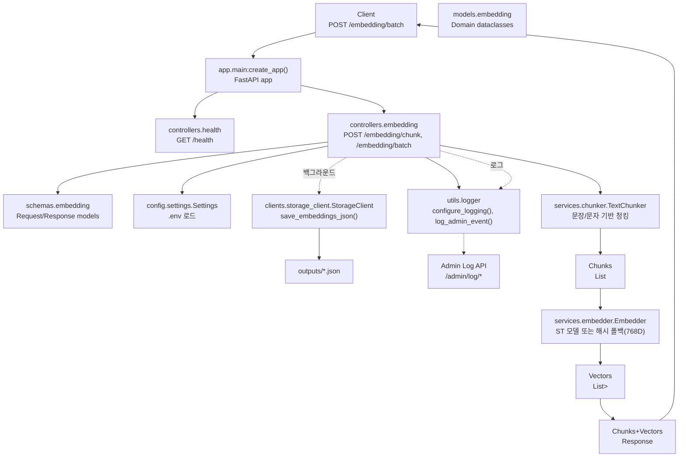

# Embedding Service 아키텍처 개요

본 문서는 서비스의 디렉터리 구조, 주요 컴포넌트 역할, 처리 흐름, 설정/실행 방법을 정리합니다.

## 디렉터리 구조와 역할
- `app/main.py`: FastAPI 앱 생성, 로깅 초기화, 라우터 등록
- `app/controllers/`
  - `health.py`: 헬스체크 엔드포인트(GET `/health`)
  - `embedding.py`: 배치 임베딩 엔드포인트(POST `/embedding/batch`)
- `app/schemas/`: 요청/응답 스키마(Pydantic)
- `app/models/`: 내부 도메인 모델(dataclass 등)
- `app/services/`
  - `chunker.py`: 텍스트 청킹(kss 사용 가능 시 문장 경계 우선, 없으면 문자 길이 기반)
  - `embedder.py`: 임베딩 생성(Sentence-Transformers 사용 가능 시 모델 사용, 실패 시 768D 결정적 해시 폴백)
- `app/clients/`
  - `storage_client.py`: 로컬 JSON 저장(`outputs/embeddings_<batch>.json`)
- `app/config/settings.py`: 설정(.env) 로드, 기본값 제공
- `app/utils/logger.py`: 로깅 설정, 어드민 로그 전송
- `tests/`: 통합 테스트와 샘플 메타데이터
- `outputs/`: 저장된 임베딩 결과 JSON

## 요청 처리 흐름(머메이드)


## 청킹과 임베딩
- **청킹(`TextChunker`)**
  - 기본: 문장 경계 우선(kss 사용 가능 시), 그렇지 않으면 문자 길이 기반
  - 주요 파라미터: `chunk_size`(기본 800), `chunk_overlap`(기본 100), `prefer_sentence_boundary`, `sentence_overlap`
- **임베딩(`Embedder`)**
  - 기본 모델: `settings.embedding_model`(예: `sentence-transformers/all-MiniLM-L6-v2`)
  - 모델 로드 실패/미설치 시: 768차원 결정적 해시 임베딩으로 폴백(재현성 보장)

## 엔드포인트
- **GET** `/health`
- **POST** `/embedding/batch`
  - **Query**
    - `save_to_storage`(bool): 결과를 `outputs/embeddings_<batch>.json` 저장
  - **Request(JSON)**
    - `batch_id`: 배치 식별자
    - `documents`: `{ id, content, metadata }` 배열
  - **Response(JSON)**
    - `batch_id`, `count`, `chunks`(각 청크의 `id/document_id/content/vector/metadata`)

## 설정(.env)
예시
```
LOG_LEVEL=INFO
EMBEDDING_MODEL=sentence-transformers/all-MiniLM-L6-v2
CHUNK_SIZE=800
CHUNK_OVERLAP=100
PREFER_SENTENCE_BOUNDARY=true
SENTENCE_OVERLAP=1
OUTPUT_DIR=outputs
# ADMIN_LOG_URL=
```

## 실행/개발
- 서버 실행(Windows PowerShell)
```
.venv\Scripts\uvicorn.exe app.main:app --host 0.0.0.0 --port 8080 --reload
```
- 테스트 실행
```
.venv\Scripts\pytest -q tests
```

## 참고
- Pydantic v2: `BaseModel.dict()`는 deprecated → `model_dump()` 권장
- 외부 연동 실패는 로깅/업서트에서 서비스 흐름을 막지 않도록 예외 처리됨
